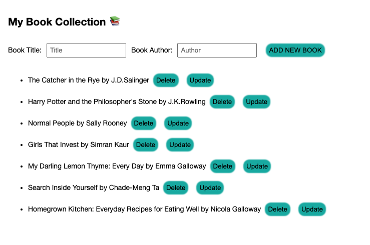

# MyLibrary 📚

MyLibrary is a repo which allows a user to create their own book collections. Users can add, update and remove books.
This is a full-stack project inclusing unit test covering over 80% of functions in the repo.

## Setup

Clone this repo, navigate to it, install packages, run migrations and seeds, and start the server.
  

    
Tip

    cd my-library
    npm i
    npm run knex migrate:latest
    npm run knex seed:run
    npm run dev

  

